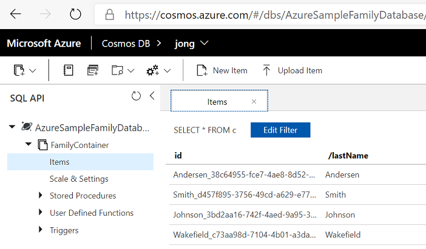

# Developing a Python app using Azure Cosmos DB
Azure Cosmos DB is Microsoft’s globally distributed multi-model database service. One of the supported APIs is the SQL API, which provides a JSON document model with SQL querying and JavaScript procedural logic. This sample shows you how to use the Azure Cosmos DB with the SQL API to store and access data from a Python application.

> You will find a detailed Quickstart here: [Build a Python application using an Azure Cosmos DB SQL API account](https://docs.microsoft.com/azure/cosmos-db/create-sql-api-python)

## Running this sample

* Before you can run this sample, you must have the following prerequisites:
    * [Azure CLI](https://docs.microsoft.com/cli/azure/?view=azure-cli-latest) or [Azure Cloud Shell](https://shell.azure.com) - Install if you want to execute commands via the CLI instead of the Azure portal.
    * [Azure Cosmos DB Account](https://docs.microsoft.com/azure/cosmos-db/) using the Azure portal or the Azure CLI.
        * Create with [Azure portal](https://portal.azure.com) and select 'Core (SQL) API'.
        * Create with [Azure CLI](https://docs.microsoft.com/cli/azure/?view=azure-cli-latest) with this command: `az cosmosdb create --name <account-name> --resource-group <resource-group-name>`. Note that the default API is Core (SQL) when creating a Cosmos DB account with the CLI.
    * [Visual Studio Code](https://code.visualstudio.com/)
    * [Python extention for Visual Studio Code](https://marketplace.visualstudio.com/items?itemName=ms-python.python#overview)
    * [Python 3.6+](https://www.python.org/downloads/) with \<install location\>\Python36 and \<install location>\Python36\Scripts added to your PATH. 
    * [Azure Cosmos DB Python SDK](https://github.com/Azure/azure-sdk-for-python/tree/master/sdk/cosmos/azure-cosmos) - Install with this command: `pip install azure-cosmos`

* Clone this repository using: 
     `git clone https://github.com/Azure-Samples/azure-cosmos-db-python-getting-started.git`

* Open `cosmos_get_started.py` and substitute the `endpoint` (URI) and primary master `key` values with your Cosmos DB account's values from the Azure portal or via the Azure CLI with the following commands:
    * Endpoint: `az cosmosdb show --name <account-name> --resource-group <resource-group-name>`
    * Key: `az cosmosdb keys list --name <account-name> --resource-group <resource-group-name>`

* In Visual Studio Code, select **View** > **Integrated terminal** to open the Visual Studio Code integrated terminal.

* In the terminal, run `python cosmos_get_started.py`, which will output the following text:

    ```Read item with id Andersen_38c64955-fce7-4ae8-8d52-b51979f0952b. Operation consumed 1 request units
    Read item with id Smith_d457f895-3756-49cd-a629-e7708d7ed252. Operation consumed 1 request units
    Read item with id Johnson_3bd2aa16-742f-4aed-9a95-3adc548a94e3. Operation consumed 1 request units
    Read item with id Wakefield_c73aa98d-7104-4b01-a3da-4946081575ff. Operation consumed 1 request units
    Query returned 2 items. Operation consumed 3.09 request units
    ```

* You can view the items that this sample created by navigating to the [Azure Cosmos DB Data Explorer](https://cosmos.azure.com/) and selecting the AzureSampleFamilyDatabase:

    

## About the code
The code included in this sample is intended to get you quickly started with a Python application that connects to Azure Cosmos DB with the SQL API.

## More information
- [Quickstart: Build a Python application using an Azure Cosmos DB SQL API account](https://docs.microsoft.com/azure/cosmos-db/create-sql-api-python)
- [Azure Cosmos DB](https://docs.microsoft.com/azure/cosmos-db/introduction)
- [Azure Cosmos DB: SQL API introduction](https://docs.microsoft.com/azure/cosmos-db/sql-api-introduction)
- [Azure Cosmos DB Python SDK Reference](https://docs.microsoft.com/azure/cosmos-db/sql-api-sdk-python)
